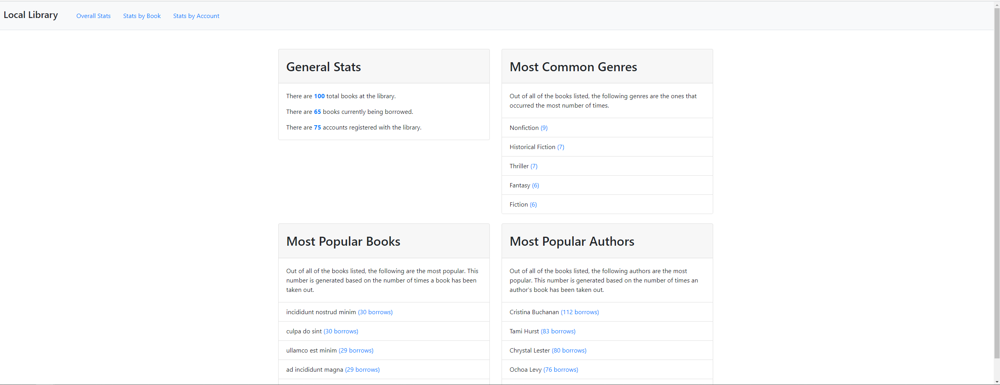
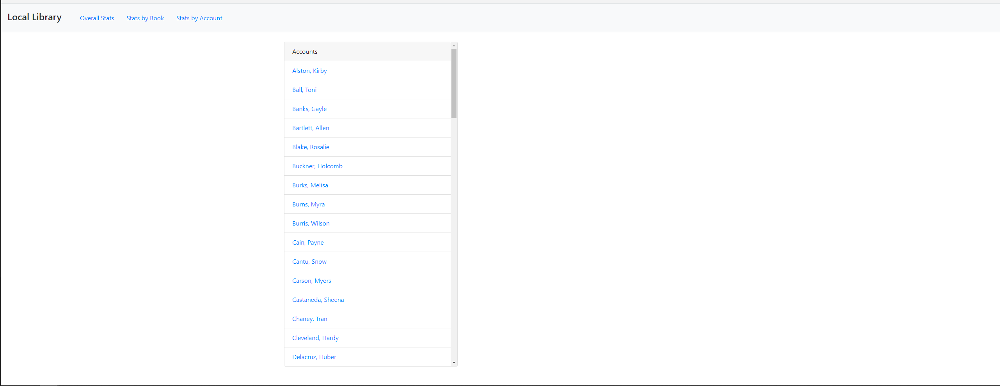
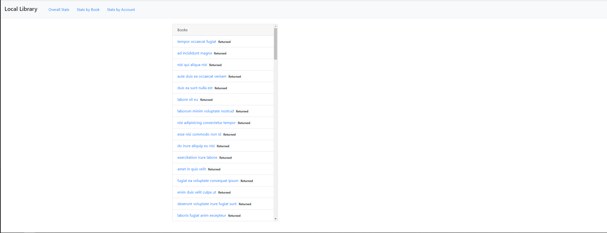

# Project Local Library
Your neighborhood has decided to put together a local library where people can lend and borrow books. 
One of the most important features to organize this is a dashboard that will show which books are available, which are currently out, and other general statistics about the program.

Others are taking care of the logistics and and design, but they need you to build the algorithms!
# Technology & Tools
- HTML
- JavaScript
- Git
# Screenshots
## Dash Board

## Stats by Accounting

## Stats by Book 

# Takeaways
- Stong understanding of the three most common JavaScript error types.
- Solved bugs by using error messages.
- Differentiate between let, const, and var, and use each appropriately.
- Learned to access all the values and keys of an object.
- Learned the apropriate use cases for array methods such as .find(), .filter(), .map(), .some(), .sort(), and .every()
